# Тестування працездатності системи

Цей проєкт показує базову реалізацію DAO (Data Access Object) для взаємодії з базою даних MySQL. Була використана мова Python.

1. Створення користувача

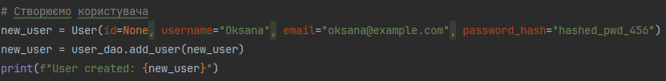

Результат:

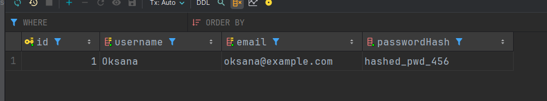

---

2. Створення проекту\
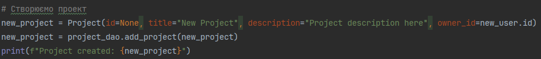

Результат:\
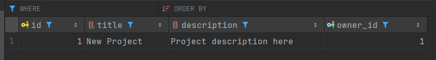

---

3. Створення дошки для проекту\
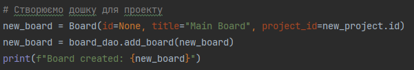

Результат:\
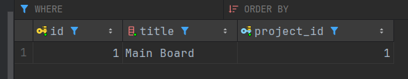

---

4. Створення колонки на дошці\
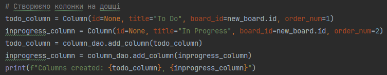

Результат:\
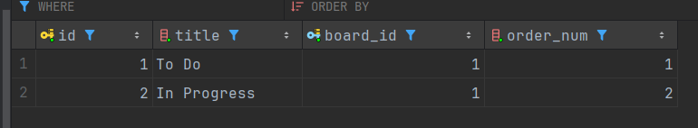

---

5. Створення задачі\
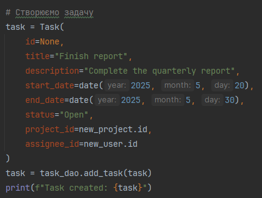

Результат:\
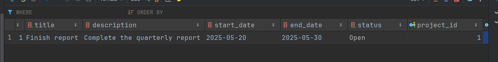

---

6. З'єднання задачі з колонкою\
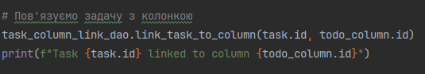

Результат:\
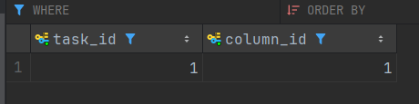

---

7. Створення коментаря\
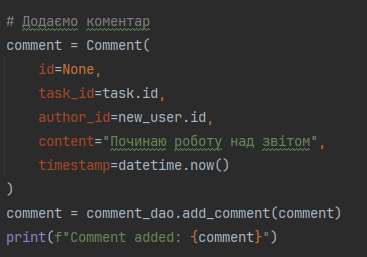

Результат:\
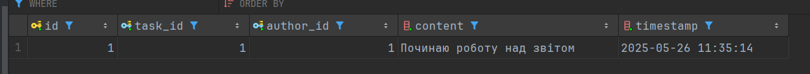

